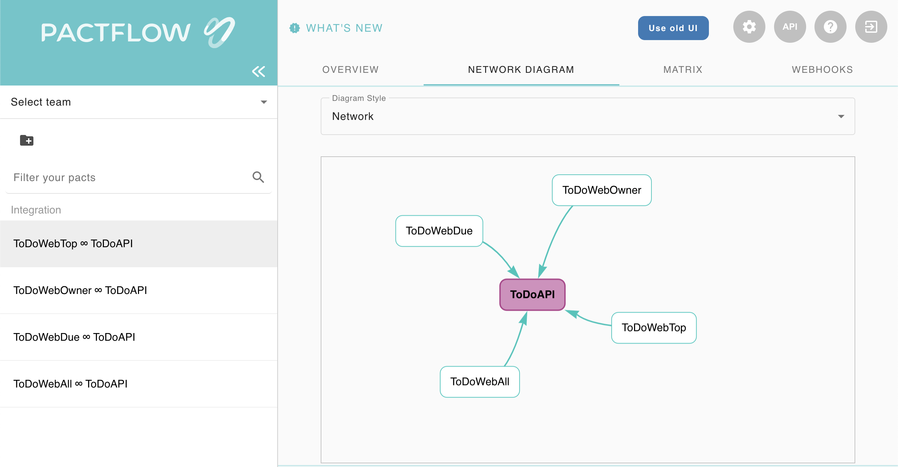

# tdd-pact
## Overview
This tutorial demonstrates how to set up a contract test between multiple [React](https://reactjs.org/) applications (consumers)and a single [Spring Boot](https://spring.io/projects/spring-boot) service (provider).  This tutorial will use [Pact](https://pact.io/) to [test drive](https://en.wikipedia.org/wiki/Test-driven_development) each consumer call to the provider.

> **Consumer**: An application that makes use of the functionality or data from another application to do its job. For applications that use HTTP, the consumer is always the application that initiates the HTTP request (eg. the web front end), regardless of the direction of data flow. For applications that use queues, the consumer is the application that reads the message from the queue. https://docs.pact.io/getting_started/how_pact_works

> **Provider**: An application (often called a service) that provides functionality or data for other applications to use, often via an API. For applications that use HTTP, the provider is the application that returns the response. For applications that use queues, the provider (also called producer) is the application that writes the messages to the queue. https://docs.pact.io/getting_started/how_pact_works

<details>
  <summary>Tutorial Approach</summary>
  
## Tutorial Approach
This project has 4 consumers:
- consumer-todo-all
- consumer-todo-due
- consumer-todo-owner
- consumer-todo-top

Each consumer is a separate React app that calls the same provider [endpoint](https://swagger.io/docs/specification/paths-and-operations).

http://localhost:3000/todo  

```
[
{
  "id": 1,
  "description": "Take out the garbage",
  "dueDate": "2022-02-23T13:10:21.125+00:00",
  "priority": 5,
  "status": "TODO",
  "owner": "bsmith",
  "created": "2022-02-18T13:10:21.125+00:00",
  "lastModified": "2022-02-18T13:10:21.125+00:00"
},
{
  "id": 2,
  "description": "Wash the dishes",
  "dueDate": "2022-02-28T13:10:21.125+00:00",
  ...
}
]
```

However, however each consumer uses the response in different ways.  The consumer-todo-all app simply lists all of the todo descriptions in a list.  While consumer-todo-all only cares about the description field, the consumer-todo-due app also uses the dueDate field and sorts the list of todo's by due date.  Each of the 4 consumer apps use the provider's response slightly differently.  These different consumer expectations are called contracts or pacts.  As a provider gains more consumers it's important for the provider to understand how each consumer is using thier service.  [Contract tests](https://docs.pact.io/) solve this problem.  

> **Contract tests** assert that inter-application messages conform to a shared understanding that is documented in a contract. https://docs.pact.io/

In this tutorial we will test drive each consumer interaction with the provider.  Tests will start in each consumer and the resulting contract will drive the creation of the provider's endpoint.  This is called [consumer driven contract testing](https://docs.pact.io/#consumer-driven-contracts).

</details>

<details>
  <summary>Running Applications Together</summary>
  
## Running Applications Together
### Prerequisites
- [Node](https://nodejs.org/) 14 or higher
- [Java](https://aws.amazon.com/corretto) 8 or higher

### Steps
1. Open a separate terminal window for each application.
1. Within each terminal window `cd` into the application that that window will run (example: `cd {your-path-to-this-project}/tdd-pact/consumer-todo-all`)
1. Start the application *(see each application's `README.md` for more information)*
    1. For the consumer applications run `npm start` within each terminal window.
    1. For the provider-todo application run `./mvnw spring-boot:run`. Open http://localhost:3000/todo

</details>

<details>
  <summary>Test Driving Consumer ToDo All Contract</summary>
  The first step in test driving the contract between the consumer and the provider is to write a unit test.

  ### Set Up

  - `cd` into the `consumer-todo-all` directory
  - Sign up for a free [Pactflow Account](https://pactflow.io/try-for-free/)
  - Copy your [Pactflow Copy Environment Variables](https://docs.pactflow.io/#configuring-your-api-token)
  - Add these these Environment Variables to your machine
  - run `npm i @pact-foundation/pact`
  - In your `package.json` file add the following script

  ```
  "scripts": {
    ... ,
    "pact:publish": "pact-broker publish ./pacts --consumer-app-version=1.0.0 --broker-base-url=$PACT_BROKER_BASE_URL --broker-token=$PACT_BROKER_TOKEN"
  },
  ```

  ### Write a failing test
- add a new test under `src/test` with the name `ToDoIntegration.test.js` and the following contents

```js
import { Pact } from '@pact-foundation/pact';
import { Matchers } from '@pact-foundation/pact';
import { like } from '@pact-foundation/pact/src/dsl/matchers';
import { findAll } from '../ToDoRepository';
const { eachLike } = Matchers;


const provider = new Pact({
consumer: 'ToDoWebAll',
provider: 'ToDoAPI',
});

describe('ToDo Service', () => {
  describe('When a request to list all todos is made', () => {
    beforeAll(() =>
      provider.setup().then(() => {
        provider.addInteraction({
          uponReceiving: 'a request to list all todos',
          withRequest: {
            method: 'GET',
            path: '/todos',
          },
          willRespondWith: {
              body: eachLike({
                id: like(1),
                description: like('description 1'),
              }),
              status: 200,
              headers: {
                'Content-Type': 'application/json',
              },
            },
          })
        }))

    test('should return the correct data', async () => {
      const response = await findAll(provider.mockService.baseUrl);
      expect(response[0].id).toBe(1);
      expect(response[0].description).toBe('description 1');
    });

    afterEach(() => provider.verify());
    afterAll(() => provider.finalize());
  });
});
```
- `provider = new Pact({...` creates a mock API server that listens for calls from `ToDoRepository.findAll()`.  This is powerful because now the consumer can call a provider before the real endpoint even exists. 
- `provider.addInteraction({...` sets up canned API endpoint responses
- `provider.verify()` validates that the interactions you set up were actually called
- `provider.finalize()` writes the pact file to the `pacts` directory at the root of `consumer-todo-all` and shuts down the mock server.

### Run Integration Test
- run `npm test`
- This will produce a contract in the `pacts` directory

### Publish Contract to Pactflow
- run `npm run pact:publish`
- Log into your Pactflow server `https://[your username].pactflow.io/` and you should seed your new contract `ToDoWebAll ∞ ToDoAPI` listed under the `Integration` heading

[Code for this section](https://github.com/pairing4good/tdd-pact/commit/c78813d426a0f1f7d7035cadb5fa2dee616ad8cb)

</details>

<details>
  <summary>Test Driving Provider Through Published Contracts</summary>
  The next step is to drive the Provider API based on the published contracts.

  ### Set Up

  - Add these these Environment Variables to your machine
    - export PACT_BROKER_HOST=[your username].pactflow.io
    - export PACT_BROKER_BASE_URL=https://$PACT_BROKER_HOST
  - Add depencency to the pom.xml

```
  <dependency>
    <groupId>au.com.dius.pact.provider</groupId>
    <artifactId>junit5spring</artifactId>
    <version>4.3.5</version>
  </dependency>
```

### Write a failing test

  ```java
package com.pairgood.todo.contract;

import org.junit.jupiter.api.BeforeEach;
import org.junit.jupiter.api.TestTemplate;
import org.junit.jupiter.api.extension.ExtendWith;
import org.springframework.boot.test.context.SpringBootTest;
import org.springframework.boot.web.server.LocalServerPort;
import org.springframework.test.context.junit.jupiter.SpringExtension;

import au.com.dius.pact.provider.junit5.HttpTestTarget;
import au.com.dius.pact.provider.junit5.PactVerificationContext;
import au.com.dius.pact.provider.junitsupport.Provider;
import au.com.dius.pact.provider.junitsupport.loader.PactBroker;
import au.com.dius.pact.provider.junitsupport.loader.PactBrokerAuth;
import au.com.dius.pact.provider.spring.junit5.PactVerificationSpringProvider;

@ExtendWith(SpringExtension.class)
@SpringBootTest(webEnvironment = SpringBootTest.WebEnvironment.DEFINED_PORT)
@Provider("ToDoAPI")
@PactBroker(scheme = "https", host = "${PACT_BROKER_HOST}", authentication = @PactBrokerAuth(token = "${PACT_BROKER_TOKEN}"))
public class ContractVerificationTest {

    @LocalServerPort
    private int port;

    @BeforeEach
    public void setUp(PactVerificationContext context){
        context.setTarget(new HttpTestTarget("localhost", port));
    }

    @TestTemplate
    @ExtendWith(PactVerificationSpringProvider.class)
    void pactVerificationTestTemplate(PactVerificationContext context) {
      context.verifyInteraction();
    }

}
  ```

- This test downloads all of the contracts for `@Provider("ToDoAPI")` and runs them agains the running Spring Boot API
- run `./mvnw test`
- The test fails with the message `Actual map is missing the following keys: description`

### Make the test go green

- The failing contract test drives the provider to add the following getter to `ToDo.java`
```java
public String getDescription() {
    return description;
}
```

- Rerun `./mvnw test`
- Green

[Code for this section](https://github.com/pairing4good/tdd-pact/commit/72e7c345f7861870e150bc2ed113e3f4a7aac681)

</details>

<details>
  <summary>Test Driving Consumer ToDo Due Contract</summary>
  With the first consumer contract in place we will add a second consumer contract from a second front end application.

  ### Set Up

  - `cd` into the `consumer-todo-due` directory
  - run `npm i @pact-foundation/pact`
  - In your `package.json` file add the following script

  ```
  "scripts": {
    ... ,
    "pact:publish": "pact-broker publish ./pacts --consumer-app-version=1.0.0 --broker-base-url=$PACT_BROKER_BASE_URL --broker-token=$PACT_BROKER_TOKEN"
  },
  ```

  ### Write a failing test

- add a new test under `src/test` with the name `ToDoIntegration.test.js` and the following contents

```js
import { Pact } from '@pact-foundation/pact';
import { Matchers } from '@pact-foundation/pact';
import { like } from '@pact-foundation/pact/src/dsl/matchers';
import { findAll } from '../ToDoRepository';
const { eachLike } = Matchers;


const provider = new Pact({
  consumer: 'ToDoWebDue',
  provider: 'ToDoAPI',
});

describe('ToDo Service', () => {
    describe('When a request to list all todos is made', () => {
      beforeAll(() =>
        provider.setup().then(() => {
          provider.addInteraction({
            uponReceiving: 'a request to list all todos',
            withRequest: {
              method: 'GET',
              path: '/todos',
            },
            willRespondWith: {
                body: eachLike({
                  id: like(1),
                  description: like('description 1'),
                  dueDate: like('2001-01-01T01:01:01.100+00:00')
                }),
                status: 200,
                headers: {
                  'Content-Type': 'application/json',
                },
              },
            })
          }))
  
      test('should return the correct data', async () => {
        const response = await findAll(provider.mockService.baseUrl);
        expect(response[0].id).toBe(1);
        expect(response[0].description).toBe('description 1');
        expect(response[0].dueDate).toBe('2001-01-01T01:01:01.100+00:00');
      });
  
      afterEach(() => provider.verify());
      afterAll(() => provider.finalize());
    });
  });
```

### Run Integration Test
- run `npm test`
- This will produce a contract in the `pacts` directory

### Publish Contract to Pactflow
- run `npm run pact:publish`
- Log into your Pactflow server `https://[your username].pactflow.io/` and you should seed your new contract `ToDoWebDue ∞ ToDoAPI` listed under the `Integration` heading

[Code for this section](https://github.com/pairing4good/tdd-pact/commit/041644bd15561a7b4bd167bc338399f538d4998a)

</details>


<details>
  <summary>Test Driving Provider Through New Contract</summary>
  The next step is to drive the Provider API based on the newly published contracts.

- run `./mvnw test`
- The test fails with the message

```
1) Verifying a pact between ToDoWebDue and ToDoAPI - a request to list all todos has a matching body

    1.1) body: $.0 Actual map is missing the following keys: dueDate

        {
        -  "description": "description 1",
        -  "dueDate": "2001-01-01T01:01:01.100+00:00",
        +  "description": "Take out the garbage",
          "id": 1
        }
```

- First, note that we did not have to change our `ContractVerificationTest` test.  It pulls down all of the consumer contracts each time it runs.  When new consumer needs are published this test fails.
- The test failure specifies which consumer/provider relationship is being tested. `Verifying a pact between ToDoWebDue and ToDoAPI`
- The test fails because `Actual map is missing the following keys: dueDate`

### Make the test go green

- The failing contract test drives the provider to add the following getter to `ToDo.java`
```java
public Date getDueDate() {
    return dueDate;
}
```

- Rerun `./mvnw test`
- Green

[Code for this section](https://github.com/pairing4good/tdd-pact/commit/4fef904b17f331628bbfde1d22671c38479c4a34)

</details>


<details>
  <summary>Test Driving Consumer ToDo Owner Contract</summary>
  With the first two consumer contracts in place we will add a third consumer contract from a third front end application.

  ### Set Up

  - `cd` into the `consumer-todo-owner` directory
  - run `npm i @pact-foundation/pact`
  - In your `package.json` file add the following script

  ```
  "scripts": {
    ... ,
    "pact:publish": "pact-broker publish ./pacts --consumer-app-version=1.0.0 --broker-base-url=$PACT_BROKER_BASE_URL --broker-token=$PACT_BROKER_TOKEN"
  },
  ```

  ### Write a failing test

- add a new test under `src/test` with the name `ToDoIntegration.test.js` and the following contents

```js
import { Pact } from '@pact-foundation/pact';
import { Matchers } from '@pact-foundation/pact';
import { like } from '@pact-foundation/pact/src/dsl/matchers';
import { findAll } from '../ToDoRepository';
const { eachLike } = Matchers;


const provider = new Pact({
  consumer: 'ToDoWebOwner',
  provider: 'ToDoAPI',
});

describe('ToDo Service', () => {
    describe('When a request to list all todos is made', () => {
      beforeAll(() =>
        provider.setup().then(() => {
          provider.addInteraction({
            uponReceiving: 'a request to list all todos',
            withRequest: {
              method: 'GET',
              path: '/todos',
            },
            willRespondWith: {
                body: eachLike({
                  id: like(1),
                  description: like('description 1'),
                  owner: like("atest")
                }),
                status: 200,
                headers: {
                  'Content-Type': 'application/json',
                },
              },
            })
          }))
  
      test('should return the correct data', async () => {
        const response = await findAll(provider.mockService.baseUrl);
        expect(response[0].id).toBe(1);
        expect(response[0].description).toBe('description 1');
        expect(response[0].owner).toBe('atest');
      });
  
      afterEach(() => provider.verify());
      afterAll(() => provider.finalize());
    });
  });
```

### Run Integration Test
- run `npm test`
- This will produce a contract in the `pacts` directory

### Publish Contract to Pactflow
- run `npm run pact:publish`
- Log into your Pactflow server `https://[your username].pactflow.io/` and you should seed your new contract `ToDoWebOwner ∞ ToDoAPI` listed under the `Integration` heading

[Code for this section](https://github.com/pairing4good/tdd-pact/commit/a9db233c4301441bd2c1345f0a28b84eae3c7b1b)

</details>


<details>
  <summary>Test Driving Provider Through Newest Contract</summary>
  The next step is to drive the Provider API based on the newly published contracts.

- run `./mvnw test`
- The test fails with the message

```
1) Verifying a pact between ToDoWebOwner and ToDoAPI - a request to list all todos has a matching body

    1.1) body: $.0 Actual map is missing the following keys: owner

        {
        -  "description": "description 1",
        -  "id": 1,
        -  "owner": "atest"
        +  "description": "Take out the garbage",
        +  "dueDate": "2022-02-23T19:52:12.254+00:00",
        +  "id": 1
        }
```

- The test failure specifies which consumer/provider relationship is being tested. `Verifying a pact between ToDoWebOwner and ToDoAPI`
- The test fails because `Actual map is missing the following keys: owner`

### Make the test go green

- The failing contract test drives the provider to add the following getter to `ToDo.java`
```java
public String getOwner() {
    return owner;
}
```

- Rerun `./mvnw test`
- Green

[Code for this section](https://github.com/pairing4good/tdd-pact/commit/2c436e3f738fe7d680682de2fc4bfb4ea8a193f5)

</details>

<details>
  <summary>Test Driving Consumer ToDo Top Contract</summary>
  With the first two consumer contracts in place we will add a third consumer contract from a third front end application.

  ### Set Up

  - `cd` into the `consumer-todo-top` directory
  - run `npm i @pact-foundation/pact`
  - In your `package.json` file add the following script

  ```
  "scripts": {
    ... ,
    "pact:publish": "pact-broker publish ./pacts --consumer-app-version=1.0.0 --broker-base-url=$PACT_BROKER_BASE_URL --broker-token=$PACT_BROKER_TOKEN"
  },
  ```

  ### Write a failing test

- add a new test under `src/test` with the name `ToDoIntegration.test.js` and the following contents

```js
import { Pact } from '@pact-foundation/pact';
import { Matchers } from '@pact-foundation/pact';
import { like } from '@pact-foundation/pact/src/dsl/matchers';
import { findAll } from '../ToDoRepository';
const { eachLike } = Matchers;


const provider = new Pact({
  consumer: 'ToDoWebTop',
  provider: 'ToDoAPI',
});

describe('ToDo Service', () => {
    describe('When a request to list all todos is made', () => {
      beforeAll(() =>
        provider.setup().then(() => {
          provider.addInteraction({
            uponReceiving: 'a request to list all todos',
            withRequest: {
              method: 'GET',
              path: '/todos',
            },
            willRespondWith: {
                body: eachLike({
                  id: like(1),
                  description: like('description 1'),
                  created: like('2001-01-01T01:01:01.100+00:00')
                }),
                status: 200,
                headers: {
                  'Content-Type': 'application/json',
                },
              },
            })
          }))
  
      test('should return the correct data', async () => {
        const response = await findAll(provider.mockService.baseUrl);
        expect(response[0].id).toBe(1);
        expect(response[0].description).toBe('description 1');
        expect(response[0].created).toBe('2001-01-01T01:01:01.100+00:00');
      });
  
      afterEach(() => provider.verify());
      afterAll(() => provider.finalize());
    });
  });
```

### Run Integration Test
- run `npm test`
- This will produce a contract in the `pacts` directory

### Publish Contract to Pactflow
- run `npm run pact:publish`
- Log into your Pactflow server `https://[your username].pactflow.io/` and you should seed your new contract `ToDoWebTop ∞ ToDoAPI` listed under the `Integration` heading

[Code for this section](https://github.com/pairing4good/tdd-pact/commit/3a6e1f9bf576b763dfb854fc1026717488f663ed)

</details>


<details>
  <summary>Test Driving Provider Through Newest Contract</summary>
  The next step is to drive the Provider API based on the newly published contracts.

- run `./mvnw test`
- The test fails with the message

```
1) Verifying a pact between ToDoWebTop and ToDoAPI - a request to list all todos has a matching body

    1.1) body: $.0 Actual map is missing the following keys: created

        {
        -  "created": "2001-01-01T01:01:01.100+00:00",
        -  "description": "description 1",
        -  "id": 1
        +  "description": "Take out the garbage",
        +  "dueDate": "2022-02-23T19:52:12.254+00:00",
        +  "id": 1,
        +  "owner": "bsmith"
        }
```

- The test failure specifies which consumer/provider relationship is being tested. `Verifying a pact between ToDoWebTop and ToDoAPI`
- The test fails because `Actual map is missing the following keys: created`

### Make the test go green

- The failing contract test drives the provider to add the following getter to `ToDo.java`
```java
public Date getCreated() {
    return created;
}
```

- Rerun `./mvnw test`
- Green

[Code for this section](https://github.com/pairing4good/tdd-pact/commit/9cb0bea9ba8160e35c9d68a3ad85f30877e7e5bc)

</details>

<details>
  <summary>Java Consumer to Java Provider</summary>

  Many providers depend on other providers too.  In this section we will test drive a new owner provider that `provider-todo` will use to look up owner usernames.

  ### Set Up

  - `cd` into the `producer-todo` directory
  - Add dependencies to the pom.xml

```
<dependency>
  <groupId>org.springframework.boot</groupId>
  <artifactId>spring-boot-starter-webflux</artifactId>
</dependency>
<dependency>
  <groupId>au.com.dius</groupId>
  <artifactId>pact-jvm-consumer-junit_2.11</artifactId>
  <version>3.5.0</version>
  <scope>test</scope>
</dependency>
```

  - Add plugin to the pom.xml

```
<plugin>
  <groupId>au.com.dius.pact.provider</groupId>
  <artifactId>maven</artifactId>
  <version>4.3.5</version>
  <configuration>
    <pactBrokerUrl>${env.PACT_BROKER_BASE_URL}</pactBrokerUrl>
    <pactBrokerToken>${env.PACT_BROKER_TOKEN}</pactBrokerToken>
    <pactBrokerAuthenticationScheme>Bearer</pactBrokerAuthenticationScheme>
  </configuration>
</plugin>
```

### Write a failing test

- add a new test under `src/test/java/com/pairgood/todo/contract` with the name `ConsumerOwnerContractTest.java` and the following contents

```java
package com.pairgood.todo.contract;

import au.com.dius.pact.consumer.Pact;
import au.com.dius.pact.consumer.PactProviderRuleMk2;
import au.com.dius.pact.consumer.PactVerification;
import au.com.dius.pact.consumer.dsl.PactDslJsonBody;
import au.com.dius.pact.consumer.dsl.PactDslWithProvider;
import au.com.dius.pact.model.RequestResponsePact;
import org.junit.Rule;
import org.junit.Test;

import java.util.Collections;
import java.util.Map;

import static org.junit.Assert.assertEquals;
import static org.junit.jupiter.api.Assertions.assertNotNull;

import com.pairgood.todo.service.Owner;
import com.pairgood.todo.service.OwnerService;

public class ConsumerOwnerContractTest {

    private int port = 8080;

    @Rule
    public PactProviderRuleMk2 mockProvider = new PactProviderRuleMk2("OwnerAPI", "localhost", port, this);

    @Pact(consumer = "ToDoAPI", provider = "OwnerAPI")
    public RequestResponsePact createPact(PactDslWithProvider builder) {
        Map<String, String> headers = Collections.singletonMap("Content-Type", "application/json");
        PactDslJsonBody body = new PactDslJsonBody().stringType("username", "testUsername");

        return builder
          .given("test GET")
            .uponReceiving("GET REQUEST")
            .path("/owners/1")
            .method("GET")
          .willRespondWith()
            .status(200)
            .headers(headers)
            .body(body)
          .toPact();
    }

    @Test
    @PactVerification()
    public void shouldReturnOnwer(){
        Owner owner = new OwnerService("http://localhost:" + port).findById(1);
        assertNotNull(owner);
        assertEquals("testUsername", owner.getUsername());
    }
}
```

- [@Rule](https://docs.pact.io/implementation_guides/jvm/consumer/junit/#using-the-pact-junit-rule) sets up and tears down the mock provider.
- [@Pact](https://docs.pact.io/implementation_guides/jvm/consumer/junit/#using-the-pact-junit-rule) sets up the available mock provider endpoints, requests and responses.
- [@PactVerification()](https://docs.pact.io/implementation_guides/jvm/consumer/junit/#using-the-pact-junit-rule) runs the `@Test` with the mock pact server running

### Make it go green
- add a new test under `src/main/java/com/pairgood/todo/service` with the name `OwnerService.java` and the following contents

```java
package com.pairgood.todo.service;

import org.springframework.http.HttpHeaders;
import org.springframework.http.MediaType;
import org.springframework.web.reactive.function.client.WebClient;

public class OwnerService {

    private WebClient webClient;

    public OwnerService(String baseUrl){
        webClient= WebClient.builder()
        .baseUrl(baseUrl)
        .defaultHeader(HttpHeaders.CONTENT_TYPE, MediaType.APPLICATION_JSON_VALUE)
        .build();
    }

    public Owner findById(long id){
        return webClient.get()
		.uri("/owners/" + id)
		.retrieve()
		.bodyToMono(Owner.class).block();
    }
}
```
- add a new test under `src/main/java/com/pairgood/todo/service` with the name `Owner.java` and the following contents

```java
package com.pairgood.todo.service;


public class Owner{

    private Long id;
    private String username;

    public long getId() {
        return id;
    }

    public void setId(Long id){
        this.id = id;
    }

    public String getUsername() {
        return username;
    }

    public void setUsername(String username) {
        this.username = username;
    }
}
```
- rerun the test
- green

### Publish pact
- run `./mvnw pact:publish`
- Log into your Pactflow server `https://[your username].pactflow.io/` and you should seed your new contract `ToDoAPI ∞ OwnerAPI` listed under the `Integration` heading
</details>

<details>
  <summary>Pactflow Network Diagram</summary>

  One powerful benefit of using Pactflow is their network diagram.  This helps teams visualize consumer/producer relationships across their enterprise.

  
</details>